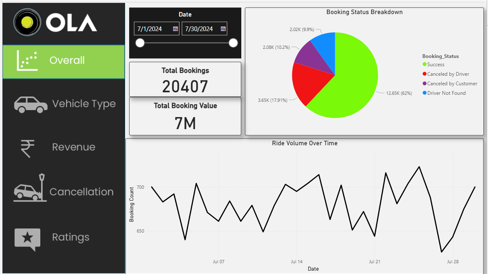
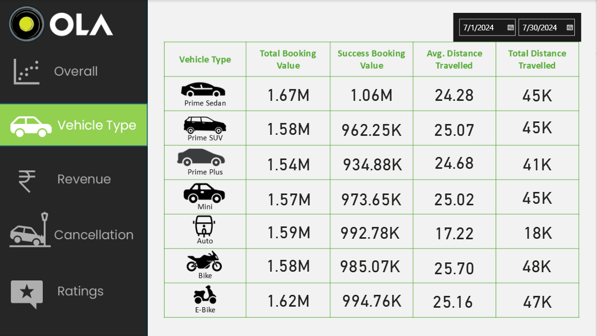
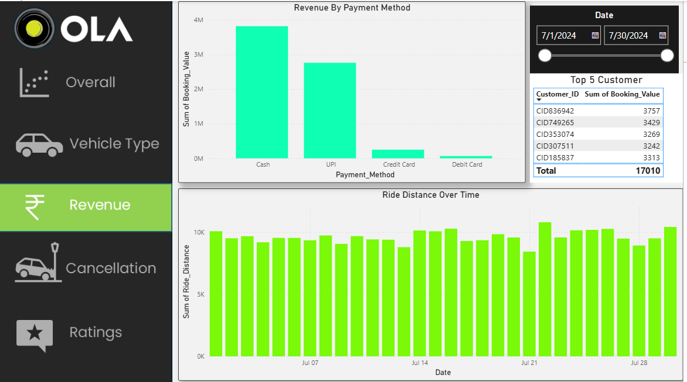
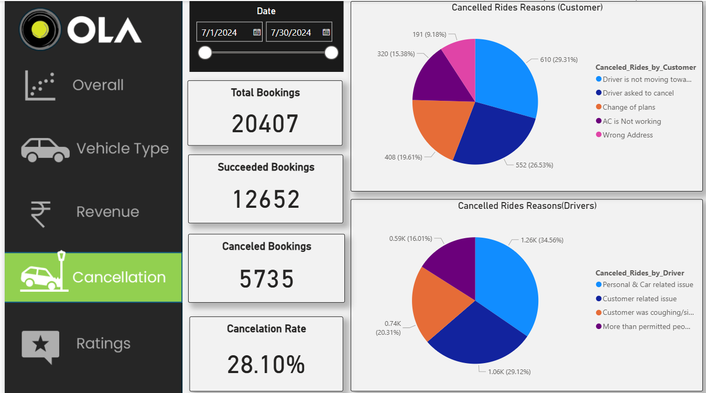
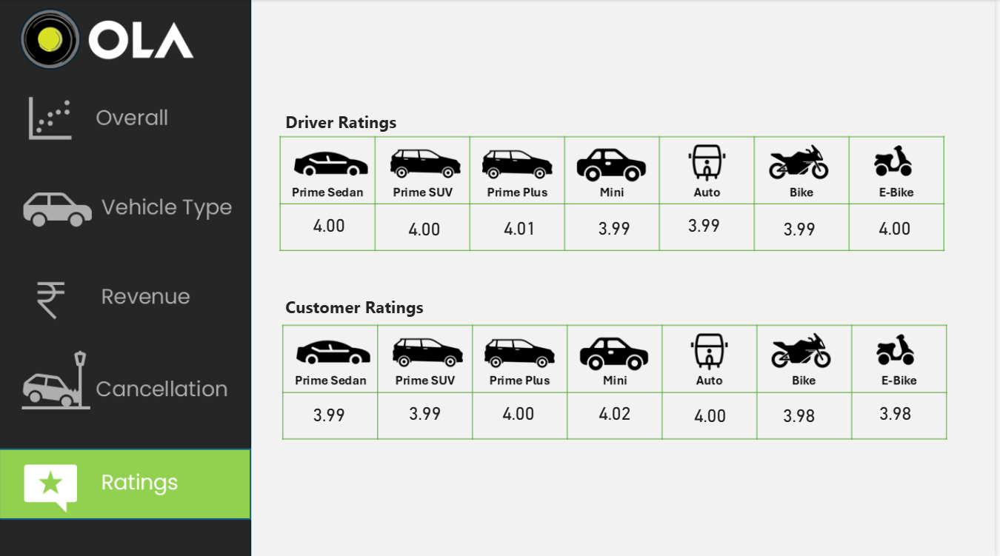

# 🚖 OLA Ride Data Analysis | End-to-End Data Analytics Project

## 📌 Project Overview

This project analyzes **20K+ OLA ride booking records** to extract actionable business insights on booking trends, cancellations, revenue patterns, and customer/driver behavior. It demonstrates a complete end-to-end data analytics workflow using **Advanced Excel, SQL, and Power BI**.

---

## 🛠️ Tools & Technologies

* **Advanced Excel** – Data Cleaning & Preprocessing
* **MySQL (SQL)** – Data Extraction & Analysis
* **Power BI** – Dashboard Development & Data Visualization
* **Power Query** – ETL (Extract, Transform, Load)
* **DAX** – KPI & Business Metrics Calculation

---

## 🔄 Data Cleaning & ETL

* Removed **duplicates, missing values, and blank rows**
* Split **date & time into separate columns** and corrected data types
* Standardized data formats for consistency
* Prepared structured dataset for analysis and reporting

---

## 🗃️ SQL Data Analysis

* Developed queries using **JOINs, GROUP BY, subqueries, and aggregations**
* Analyzed booking success rate, cancellations, revenue, and ratings
* Applied filtering conditions (e.g., excluding invalid ratings) for accurate analysis

---

## 📊 Power BI Dashboard

* Built **interactive dashboards** with filters and slicers
* Created DAX measures:

  * Total Bookings
  * Successful Bookings
  * Cancellation Rate (%)
* Visualized:

  * Booking trends over time
  * Cancellation reasons (customer vs driver)
  * Vehicle-wise performance and ratings

---

## 📈 Key Business Insights

* Approximately **28% of total bookings were cancelled**, indicating operational inefficiencies
* Major cancellations occurred due to **driver unavailability and customer-side issues**
* **Prime vehicle categories generated higher revenue** compared to others
* Customer and driver ratings averaged around **~4.0 after excluding invalid values**
* Identified **peak booking demand periods**, highlighting usage patterns

---

## 📂 Project Structure

* 📁 Excel Dataset
* 📁 SQL Queries
* 📁 Power BI Dashboard (.pbix)

---

## 🚀 Conclusion

This project demonstrates a complete **end-to-end data analytics pipeline** — from data cleaning and transformation to SQL-based analysis and dashboard visualization — enabling data-driven decision making.

---

## 📸 Dashboard Preview  

### Overall Dashboard

### Vehicle Analysis

### Revenue Analysis

### Cancellation Analysis

### Ratings Analysis

⭐ If you found this project useful, feel free to explore and give it a star!
